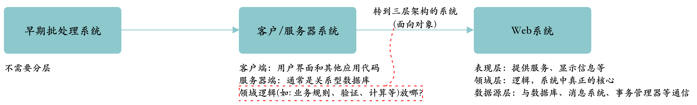

[toc]

### 1. 分层（Layering)

**分层（*Layering*）** 是分解复杂的软件系统最常用技术之一，如：FTP层架构在TCP层上，TCP架构在IP之上，IP又架构在以太网上。

分层的好处：

- 可以将某一层作为一个有机整体来理解，而无需过多了解其他层次。
- 可以替换某一层的具体实现，只需保证提供的服务相同即可。
- 可以将层次之间的依赖性减到最低。
- 分层有利于标准化工作。
- 一旦构建好某一层次，就可以用它为很多上层服务提供支持。

例如，在无需了解以太网的工作细节，可以基于TCP/IP构建FTP服务，同时TCP/IP可以被FTP、SSH、HTTP等使用，即使修改了TCP/IP的实现只要提供的服务不变，则FTP等服务就不会有影响，TCP和IP即是关于它们各自层次如何工作的标准。

分层的缺点：

- 层次不能封装所有东西，可能带来级联修改。
- 过多的层次会影响性能。

分层架构中最困难的问题是**决定建立哪些层次**和**每一层的职责是什么**。

从最初不需要层次到Web三层架构的系统，应用中层次的演化如下所示：

### 2. 三个基本层次（The Three Principal Layers）

